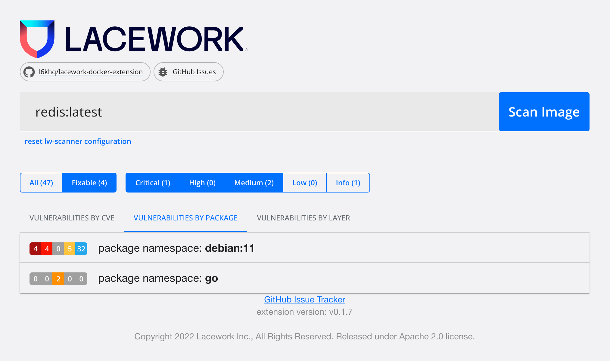

# Lacework Docker Extension

This is a public beta and released as open source.  This extension relies on `lw-scanner` which is automatically downloaded as part of the docker image build.  

To use this extension, an active Lacework subscription is required with access to a Lacework inline scanner token.

For any recommendations, suggestions, feature requests and issue, head over the the project's [GitHub Issues tracker](https://github.com/l6khq/lacework-docker-extension/issues).



## Enabling Docker Extensions

To install extensions not yet listed in the Docker Desktop extension market place, follow the instructions here [https://docs.docker.com/desktop/extensions-sdk/](https://docs.docker.com/desktop/extensions-sdk/#prerequisites)

### Install Docker Desktop Extensions SDK on Mac

For other operating systems, refer to the instructions above.

1. Download the extensions-cli for Mac from [https://github.com/docker/extensions-sdk/releases/latest](docker/extensions-sdk/releases)
2. Extract the downloaded file (i.e. `tar -xvzf desktop-extension-cli-darwin-amd64.tar.gz`)
3. Create a CLI plugins directory: `mkdir -p ~/.docker/cli-plugins`
4. Moved the extensions SDK cli to that directory: `mv docker-extension ~/.docker/cli-plugins`

### Installing the Lacework Docker extension

`docker extension install lacework/lacework-docker-extension:latest`

or, if the extension is already installed, you can easily upgrade with

`docker extension update lacework/lacework-docker-extension:latest`

## Development

To enable Honeycomb event logging, ensure the following are build arguments for the docker build.
- `HONEYCOMB_TEAM` api key for sending data to honeycomb
- `HONEYCOMB_DATASET` dataset for honeycomb

### Honeycomb Events

The image on docker hub collects the following metrics
- scanner version
- successful scan
(image names, or other identifying information is not collected)

# License and Copyright
License and copyright is for contents within this repository only.

Copyright 2022, Lacework Inc.

```
Licensed under the Apache License, Version 2.0 (the "License");
you may not use this file except in compliance with the License.
You may obtain a copy of the License at

    http://www.apache.org/licenses/LICENSE-2.0

Unless required by applicable law or agreed to in writing, software
distributed under the License is distributed on an "AS IS" BASIS,
WITHOUT WARRANTIES OR CONDITIONS OF ANY KIND, either express or implied.
See the License for the specific language governing permissions and
limitations under the License.
```
